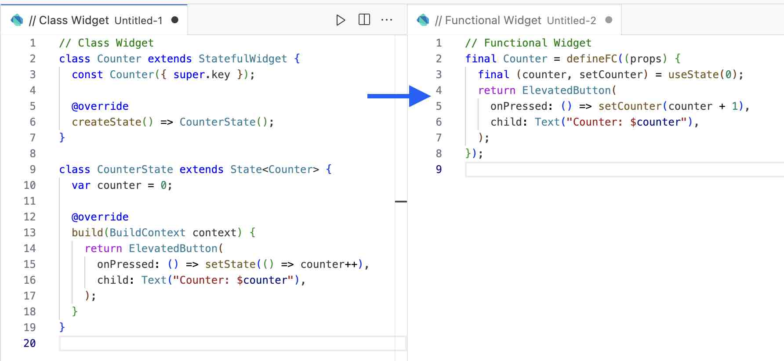

# () => Text("FC in Flutter")

[](https://pub.dev/packages/flutter_fc)
[](https://github.com/luo3house/flutter_fc/actions/workflows/test.yaml)

An easy way to create Functional Components (FC) in Flutter, with composable hooks.

*The FC has been deployed in some production app builds.*

## Features

- ⏱️ Never wait for code generation
- 🖨️ Never verbosing State***Widget classes
- 📄 Tiny implementations without external deps
- 🪝 With powerful composable hooks
- 🐇 Speed up developing
- 🧱 Hot reload
- ⚛️ React style friendly



## Install

```yaml
dependencies:
  flutter_fc: <latest version>
```
> 
> If need destructuring. Dart 3 or greater version is required.
> https://dart.dev/resources/dart-3-migration
> 
> ```yaml
> environment:
>   sdk: '^>=3.0.3 <4.0.0'
> ```


## Quick Example

FCs may be come out as `FCWidget` classes, or by `defineFC`

### By extending FCWidget

```dart
class Counter extends FCWidget {
  const Counter({super.key});

  @override
  Widget build() {
    final (counter, setCounter) = useState(0);
    return ElevatedButton(
      onPressed: () => setCounter(counter + 1),
        child: Text("Counter: $counter"),
    );
  }
}
```

### By plain function

```dart
final Counter = defineFC((props) {
  final (counter, setCounter) = useState(0);
  return ElevatedButton(
    onPressed: () => setCounter(counter + 1),
      child: Text("Counter: $counter"),
  );
});
```

## Equip Powerful Hooks

Currently supports these hooks as following:

### useState

```dart
// Dart 3
final (flag, setFlag) = useState(false);

// Dart >= 2.12 < 3.0.0
final state = useState(false);
final flag = state.$1, setFlag = state.$2;
```

### useEffect

```dart
late Steam stream;
useEffect(() {
  final sub = stream.listen((e) {...});
  return () => sub.cancel();
}, [stream]);
```

### useMemo

```dart
final time = 0;
final seconds = useMemo(() => "${time}s");
```

### useRef

```dart
final ref = useRef(0);
ref.current; // 0

ref.current = 1;
ref.current; // 1
```

### useImperativeHandle

```dart
FCRef<Function()?> reloadRef;

useImperativeHandle(reloadRef, () {
  return () => reloadSomething();
});

// parent
reloadRef.current?.call();
```

### useBuildContext

Retrieve current FC context

```dart
final context = useBuildContext();
final theme = Theme.of(context);
```

## Development Tips

### Define Reusable Widgets

```dart
class Counter extends FCWidget {
  final int? value;
  Counter({this.value, super.key});

  @override
  Widget build() {
    final (counter, setCounter) = useState(value ?? 0);
    useEffect(() => setCounter(value ?? 0), [value]);
    return Text("Counter: $counter"");
  }
}
```

### Hot Reload

Dynamic closures are not reassembled during hot reload.To apply hot reload, move the function out of scope.

```dart
// [NO] Define from closure.
final Counter = defineFC((props) {
  final (counter, setCounter) = useState(0);
  return ElevatedButton(
    onPressed: () => setCounter(counter + 1),
      child: Text("Counter: $counter"),
  );
});

// [OK] Define from const function
_Counter(props) {
  final (counter, setCounter) = useState(0);
  return ElevatedButton(
    onPressed: () => setCounter(counter + 1),
      child: Text("Counter: $counter"),
  );
}
final Counter = defineFC(_Counter);
```


### Ignore Naming Warnings

To avoid IDE lint warnings, include FC lints preset.

```yaml
# analysis_options.yaml
include: package:flutter_fc/lints.yaml
```

or configure manually.

```yaml
analyzer:
  errors:
    body_might_complete_normally_nullable: ignore

linter:
  rules:
    non_constant_identifier_names: false
```


## Acknowledgement

React

Dart 3

## License

MIT (c) 2023-present, Luo3House.
